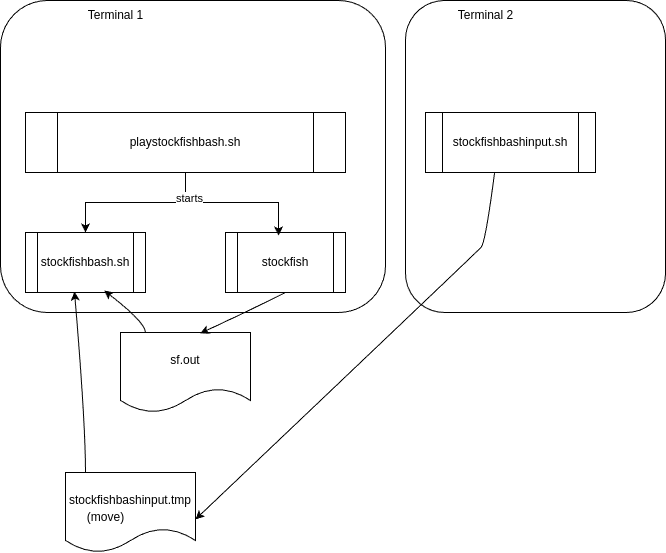

# stockfishbash
Simple bash script to play with stockfish 

## About
It's just a fun project to play directly with stockfish UCI.
When I tried to play with Stockfish via UCI without chess gui, I lack any possibility to change the current position by a move. The default communication is to set the position for each move either by FEN (+moves) or by startpos (+moves). So you have to enter all moves again and again.

I have only used the following commands to play with Stockfish:

`position startpos`
( https://official-stockfish.github.io/docs/stockfish-wiki/UCI-&-Commands.html#position )

`go depth`
(https://official-stockfish.github.io/docs/stockfish-wiki/UCI-&-Commands.html#go)

`d`
(https://official-stockfish.github.io/docs/stockfish-wiki/UCI-&-Commands.html#d)


A sample dialog with stockfish is here 
[dialog sample](dialog_sample.md)

It occurred to me to save the moves I had made so that I wouldn't have to repeat them.

I thought I had to forward my input to Stockfish via a script and in return process the output of Stockfish in this script.

The simple code is: `./stockfishbash.sh < sf.out | ./stockfish > sf.out`
Suprisingly this works (if there is an empty file `sf.out`)

But to take input for the script it needs another terminal or script to do the players input (`stockfishbashinput.sh`).



## Prerequisite
The scripts are bash scripts. Usually running with **Linux**. Here tested with [Linux Mint](https://linuxmint.com/).

## Installation

1. Clone the repo
   ```sh
   git clone https://github.com/SamuelWiet/stockfishbash.git
   ```
2. Download and / or copy stockfish from https://stockfishchess.org/download/ as `stockfish` into the repo-directory.

## Usage

Start `./playstockfishbash.sh` in one bash terminal. Stockfish should start and the script should ask for your move. In another terminal start `./stockfishbashinput.sh` to enter a move in the uci format, e.g. e2e4 (castling e1g1).

By default stockfish plays black. To play white start the script `./playstockfishbash.sh` with parameter `-c b`.
To set another depth than the default (4) start with parameter `-d ` and your wished depth, e.g.  `./playstockfishbash.sh -d 30`.
